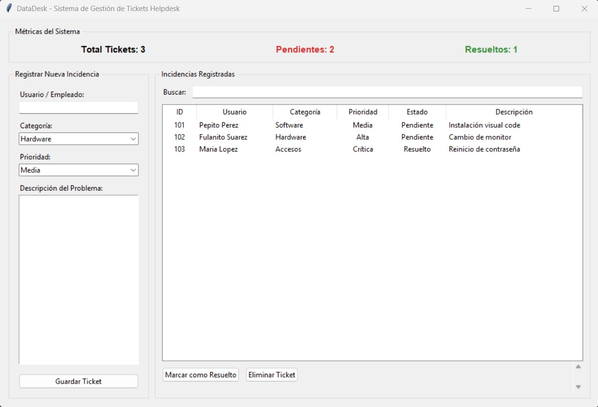

# DataDesk - Helpdesk System

Una aplicación de escritorio moderna y modular construida con **Python** y **Tkinter** para la gestión ágil de tickets e incidencias técnicas. Diseñada bajo el patrón de arquitectura **Separación de Responsabilidades (SoC)**.

---

## Vista Previa
Captura de pantalla de la aplicación en funcionamiento


---

## Características Principales

- **Gestión CRUD Completa:** Registro, consulta, actualización de estado (Pendiente / Resuelto) y eliminación de incidencias.
- **Métricas en Tiempo Real:** Cálculo automático del total de tickets, tickets pendientes y tickets resueltos.
- **Buscador Reactivo:** Filtrado en tiempo real a medida que el usuario escribe.
- **Persistencia de Datos:** Almacenamiento automático y lectura segura a través de archivos en formato `JSON`.
- **Arquitectura Modular (SoC):** Estructura dividida en capas independientes (Modelos, Vistas y Controlador/Entrada).

---

## Tecnologías Utilizadas

- **Lenguaje:** Python 3.13.14
- **Interfaz Gráfica:** Tkinter / TTK (Treeview, Combobox, Frame, Messagebox)
- **Persistencia:** Módulo nativo `json`
- **Tipado:** Type Hints para código limpio y mantenible

---

## 📁 Estructura del Proyecto

```text
helpdesk_project/
├── models.py     # Capa de Lógica de Negocio, POO y Persistencia JSON
├── views.py      # Capa de Interfaz Gráfica (GUI con Tkinter)
└── main.py       # Punto de Entrada de la Aplicación